# Description

Ce plugin permet de :

- utiliser l'implementation native de Google pour la gestion des objets connectés
- utiliser les interactions de jeedom en utilisant "Parler a ..."

Il peut fonctionner suivant 2 manières : 

- Standalone : vous créer les applications en mode dev coté Google puis connectez votre Jeedom au service Google
- Cloud : en passant par un service cloud mis à disposition par Jeedom (non disponible pour le moment car en cours de validation chez Google)

# Mode cloud

> **IMPORTANT**
>
> Il est important de faire les étapes suivantes dans l'ordre indiqué !!!

Après l'installation du plugin, il vous suffit d'aller sur la configuration du plugin, de selectionner le mode Cloud puis de cliquer sur "Envoyer" (cela va envoyer les informations de connexion à l'api du plugin sur le market)

Ensuite sur le market dans votre profil partie "Mes Services" puis bouton "Configuration" des assistants vocaux cocher "Activer Google Smarthome" et sauvegarder.

Il vous faut maintenant attendre 24h le temps que votre demande soit prise en compte.

> **IMPORTANT**
>
> Suite à l'activation et/ou modification des informations pour Google Smarthome il faut attendre 24h pour que cela soit prise en compte

# Mode standalone

> **IMPORTANT**
>
> Le mode standalone est une "arnaque" car cela vous fait créer une application chez Google en mode développement qui ne permet la synchronisation que pendant 3 jours après activation du mode test. Il faut donc lors de l'ajout ou modification des équipements réactiver le mode test tous les 3 jours pour pouvoir faire une synchronisation. Attention on parle bien d'une modification de la configuration si vous n'ajoutez pas ou ne modifiez pas d'équipements il n'y a rien a faire l'application marchera sans limite de temps

> **IMPORTANT**
>
> Etant donné que l'application est une application de dev coté Google ils peuvent à tout moment la couper, la supprimer ou changer les régles. Dans ce cas Jeedom ne pourra aucunement être tenu responsable en cas de mauvais fonctionnement.

> **IMPORTANT**
>
> Pour que la ou les applications marchent il faut absolument que votre jeedom soit en https avec un certificat valide (si vous avez un service pack l'accès DNS est la pour ca)

Pour rappel le plugin permet de : 

- utiliser l'implementation native de Google pour la gestion des objets connectés
- utiliser les interactions de jeedom en utilisant "Parler a ..."

Il y a donc 2 applications coté Google : une pour la partie Google Smarthome et une pour la partie intéraction (vous pouvez bien sur n'en faire que une des 2)

## Application Google Smarthome

Allez [ici](https://console.actions.google.com) puis cliquez sur "Add/import project"

Donnez un nom au projet changez les langue et region par defaut et validez : 

Sélectionnez "Home control" : 

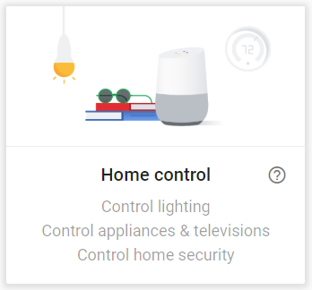

Cliquez sur "Smarthome" : 

Cliquez sur "Name your Smart Home action" :

Mettez "test smarthome" et validez (bouton Save en haut a droite) : 

Ensuite à gauche cliquez sur "Actions" : 

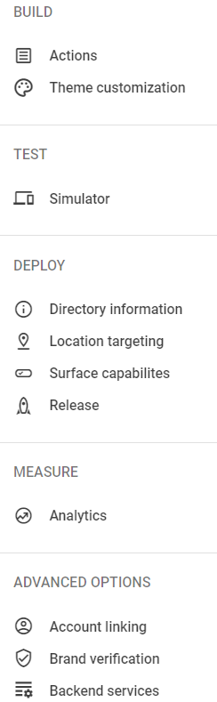

Puis "Add your first action" : 

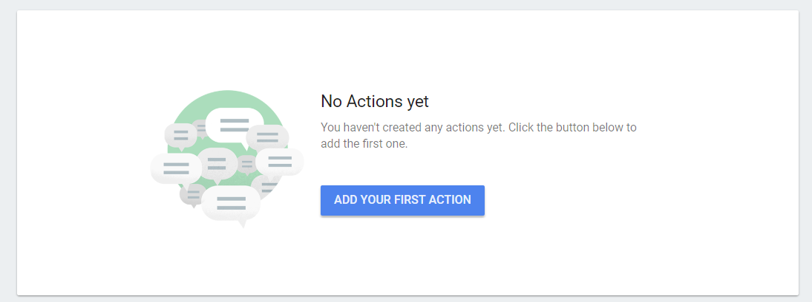

Il va falloir donner ici l'url d'arriver de Jeedom. Pour l'avoir c'est très simple, il faut dans Jeedom aller sur la page de gestion du plugin, bien choisir le mode "Standalone" (et enregistrer au passage), l'url est celle qui s'appelle "Fulfillment URL"

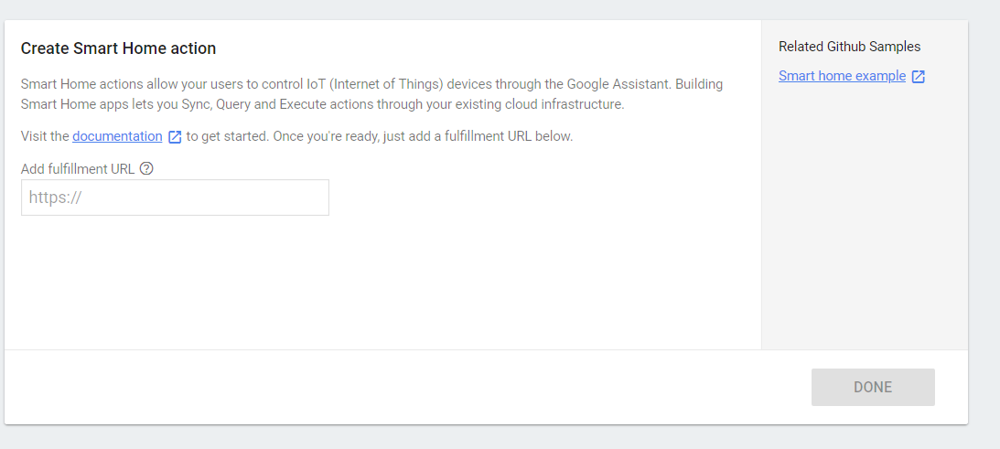

Ensuite allez dans "Account linking" (menu de gauche) : 

Selectionnez "No, I only want to allow account creation on my website" et faite "Next" : 

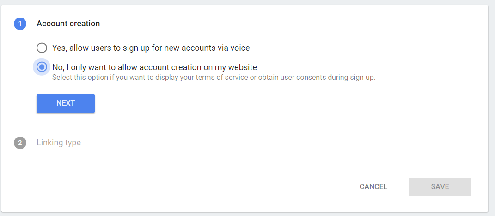

Selectionnez "OAuth" puis "Autorization code" et faite "Next" : 

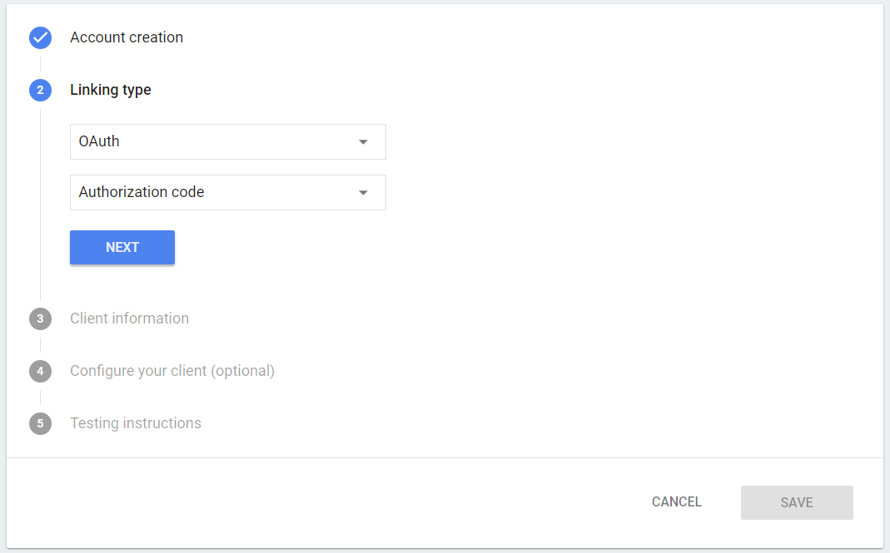

Remplissez ensuite les 4 champs en fonction de la page de configuration du plugin, puis faite "Next" :

> **NOTE**
>
> Les champs sont : 
> - le client ID en premier
> - puis le client secret
> - puis "Authorization URL" (attention à bien prendre celle de la partie "Smarthome")
> - puis "Token URL" (attention à bien prendre celle de la partie "Smarthome")

Il n'y a rien a faire la simplement "Next" : 

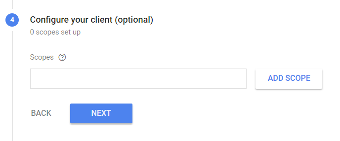

Ecrivez "Toto" puis faite "Save" : 

Il faut maintenant configuré la clef API homegraph, pour cela allez [ici](https://console.developers.google.com/apis/dashboard), puis à droite cliquez sur "Bibliothèque" : 

> **NOTE**
>
> Si vous n'avez pas de projet il vous faut en créer un

Et cherchez "Homegraph" : 

Cliquez sur homegraphapi puis activez l'api et cliquez sur gerer : 

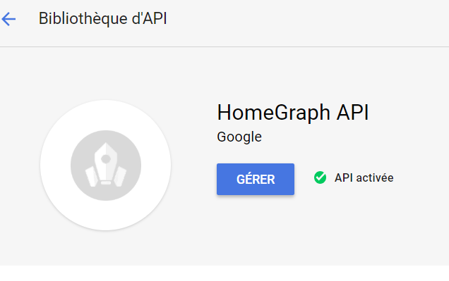

Cliquez sur identifiant à gauche : 

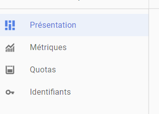

Puis sur "Identifiants des API et services" : 

Cliquez sur "Créer des identifiants" puis sur "Clé API" : 

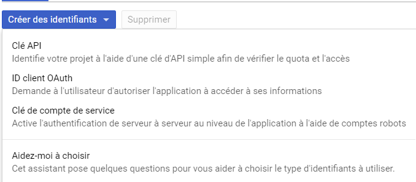

Copiez la clef API générées et collez la sur la page de gestion du plugin Google Smarthome dans "Homegraph API Google"

Derniere étape à faire donner l'id projet à Jeedom pour la gestion de la connexion, allez [ici](https://console.actions.google.com) puis cliquez sur votre projet. Recuperez l'url de la forme "https://console.actions.google.com/u/0/project/monprojet-31023/overview", l'id du projet est entre project/ et /overview, dans l'exemple ici c'est "monprojet-31023", copiez cet id sur la page de gestion du plugin Google Smarthome dans "ID du projet Smarthome".

Voila vous pouvez maintenant cliquez à gauche sur "Action" : 

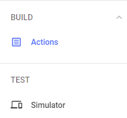

Puis sur test : 

Il vous faut ensuite sur un smartphone **android** (obligatoirement ne marche pas sur un iphone) vous connecter a votre Jeedom par **l'url externe** de celui-ci. Il faut ensuite aller dans l'application home puis "configurer ou ajouter" puis "Configurer un appareil" et enfin cliquer sur "Fonctionne avec Google" et la ajouter votre service crée plus haut (il commence par [test])

## Application Intéraction

A venir

# Configuration du plugin

Sur votre Jeedom, allez sur Plugin -> Communication -> Google Smarthome et dans la partie équipement sélectionnez les équipements à transmettre à Google ainsi que le type de l'équipement.

> **IMPORTANT**
>
> Le plugin se base sur les types génériques de Jeedom des commandes pour piloter votre domotique. Il est donc très important de configurer ceux-ci correctement.

> **NOTE**
>
> Pour le type "caméra" vous devez absolument configurer l'URL du flux (nous avons testé seulement le RTSP) pour que cela marche.
> A noter que le support des caméras est pour le moment en beta et consomme enormement de ressources

Vous pouvez aussi créer des scènes dans l'onglet scène, avec des actions d'entrée et de sortie.

> **NOTE**
>
> Lors de la sauvegarde Jeedom va automatiquement demander une synchronisation avec Google. Attention en mode standalone si vous avez une erreur essayez de réactiver le test de l'application ([ici](https://console.actions.google.com)) puis de recliquez sur le bouton de connection sur la page la page de configuration du plugin

Il ne vous reste plus qu'a faire l'affectation des équipements aux pieces dans l'application Google Home

# FAQ

>**Quelles sont les commandes possibles ?**
>
>Les commandes vocales (ainsi que les retours) sont gérés uniquement pas Google, voila la [documentation](https://support.google.com/googlehome/answer/7073578?hl=fr)

>**L'assistant me demande d'affecter les pieces mais je ne sais pas à quoi correspond l'équipement.**
>
>Oui l'assisant n'affiche pas le nom réel de l'équipement, juste le pseudo. Il faut donc quitter l'assistant et revenir sur la page d'acceuil du controle de la maison. La en cliquant sur l'équipement vous allez avoir son nom vous pourrez ensuite l'affecter à une piece

>**Pourquoi faut-il affecter des pièces à chaque équipement ?**
>
>Car Google ne permet pas de le faire par l'API vous devez donc absolument le faire manuellement.
