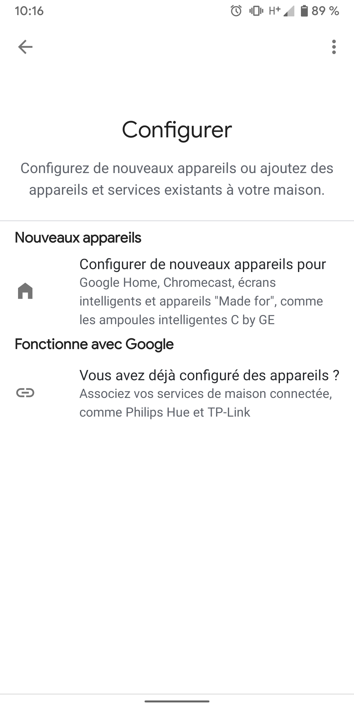
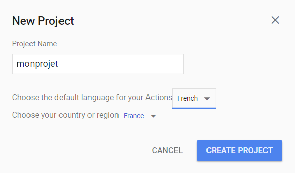
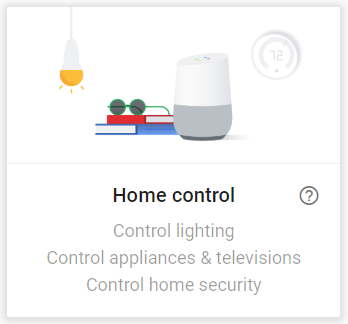
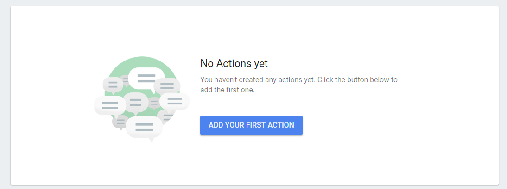
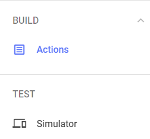

# Google smarthome plugin

Este plugin permite que você :

- use a implementação nativa do Google para o gerenciamento de objetos conectados

Pode funcionar de 2 maneiras :

- Autônomo : você cria os aplicativos no modo dev no lado do Google e conecta seu Jeedom ao serviço do Google
- Cloud : através de um serviço de nuvem fornecido pela Jeedom

> **Importante**
>
> O modo de nuvem requer uma assinatura de serviços de voz (3 meses oferecidos na compra do plugin). Você pode gerenciar sua assinatura [aqui](https://market.jeedom.com/index.php?v=d&p=profils#services)

> **Importante**
>
> Qualquer que seja o modo que você use, você DEVE ABSOLUTAMENTE ter seu Jeedom acessível em HTTPS (o plug-in não funciona em HTTP)

> **Importante**
>
> O plug-in não suporta equipamentos com funções duplas (2 saídas como certo módulo Fibaro zwave). Você absolutamente tem que passar por 2 virtuais para quebrá-lo.

# Modo de nuvem

> **Importante**
>
> É importante executar as seguintes etapas na ordem listada !!!

> **Importante**
>
> Se houver uma mensagem de erro informando que sua senha de usuário ou não está correta, você deve :
> - verifique se o Google Home está ativo no mercado
> - se for esse o caso, certifique-se de seus identificadores (atenção, você deve respeitar maiúsculas / minúsculas) ?
> - se for esse o caso, altere sua senha no mercado e na configuração do serviço de assistente de voz (guia página de perfis de mercado, meus serviços) salvou

Após instalar o plug-in, basta acessar a configuração do plug-in, selecionar o modo Cloud e clicar em "Enviar" (isso enviará as informações de conexão à API do plug-in no mercado)

Em Jeedom em Communication / Google Smarthome, você deve clicar em Salvar para enviar sua configuração inicial. Você precisa de pelo menos um dispositivo em OK (caso contrário, ao conectar a Página inicial do Google <-> Jeedom, você receberá um erro)

Em seguida, no aplicativo inicial do Google, acesse a primeira guia e clique em Adicionar (o botão +) :

Em seguida, configure um dispositivo :

Em "Funciona com o Google" :

Em seguida, na lista com o botão de pesquisa (lupa no canto superior direito), procure por "Jeedom Smarthome" e clique nele :

Insira seus identificadores de mercado (bem, aqueles que não são do seu mercado Jeedom).

No plugin -> comunicação -> Google Smarthome, você pode configurar seus diferentes equipamentos (consulte o capítulo Configuração do plugin)

>**NOTA**
>
>Para alternar do modo autônomo para o modo nuvem, você deve :
>- no plugin, vá para a nuvem e salve
>- aguarde 24h
>- no aplicativo inicial do Google, você deve dissociar o testmarthome (seu aplicativo independente)
>- em Comunicação / Google Smarthome, clique em Salvar para enviar sua configuração inicial
>- Link Jeedom Smarthome na Página inicial do Google

> **Importante**
>
>Qualquer modificação na configuração do equipamento enviado para a Página inicial do Google (adição de equipamento, exclusão de equipamento, alteração de um tipo de pedido genérico) requer necessariamente acessar Plugin -> Comunicação -> Googme Smarthome e, em seguida, salvar

# Modo autônomo

> **Importante**
>
> Se você usou o modo nuvem, não deve fazer esta parte !!! Vá diretamente para o capítulo "Configuração do plug-in"

> **Importante**
>
> O modo autônomo é uma "farsa" porque faz com que você crie um aplicativo no Google no modo de desenvolvimento, que permite a sincronização apenas por 3 dias após a ativação do modo de teste. Portanto, ao adicionar ou modificar equipamentos, reative o modo de teste a cada 3 dias para poder sincronizar. Atenção, estamos falando de uma modificação da configuração, se você não adicionar ou modificar equipamentos, não há nada para fazer, o aplicativo funcionará sem limite de tempo

> **Importante**
>
> Como o aplicativo é um aplicativo de desenvolvimento no lado do Google, eles podem cortá-lo, excluí-lo ou alterar as regras a qualquer momento. Nesse caso, a Jeedom não pode ser responsabilizada em caso de mau funcionamento.

> **Importante**
>
> Para que os aplicativos funcionem, é essencial que seu jeedom esteja em https com um certificado válido (se você tiver um service pack, o acesso ao DNS estará disponível para isso)

Como lembrete, o plug-in permite que você :

- use a implementação nativa do Google para o gerenciamento de objetos conectados
- use interações jeedom usando "Talk to ..."

Existem, portanto, 2 aplicativos listados no Google : um para a parte do Google Smarthome e outro para a parte de interação (é claro que você pode fazer apenas um dos 2)

## Aplicativo Google Smarthome

Venha [aqui](https://console.actions.google.com) depois clique em "Adicionar / importar projeto"

Dê um nome ao projeto, altere o idioma e a região padrão e valide :

Selecione "Controle doméstico" :

Clique em "Smarthome" :

Clique em "Dê um nome à sua ação do Smart Home" :

Coloque "teste de smarthome" e valide (botão Salvar no canto superior direito) :

À esquerda, clique em "Ações" :

Então "Adicione sua primeira ação" :

Teremos que dar aqui o URL para chegar de Jeedom. Para simplificar, no Jeedom você precisa acessar a página de gerenciamento de plugins, escolher o modo "Independente" (e salvar de passagem), o URL é o chamado "URL de atendimento"

Em seguida, vá para "Vinculação de conta" (menu à esquerda) :

Selecione "Não, só quero permitir a criação de contas no meu site" e faça "Avançar" :

Selecione "OAuth", depois "Código de autorização" e faça "Avançar" :

Em seguida, preencha os 4 campos de acordo com a página de configuração do plug-in e clique em "Avançar" :

> **NOTA**
>
> Os campos são :
> - ID do cliente primeiro
> - então o cliente secreto
> - depois "URL de autorização" (tome cuidado com o da seção "Smarthome"")
> - depois "URL do token" (tome cuidado com o da seção "Smarthome"")

Não há nada a fazer simplesmente "Next" :

Escreva "Toto" e faça "Salvar" :

Agora configure a chave da API do homegraph, para isso [aqui](https://console.developers.google.com/apis/dashboard), depois clique com o botão direito do mouse em "Biblioteca" :

> **NOTA**
>
> Se você não tem um projeto, precisa criar um

E procure por "Homegraph" :

Clique em homegraphapi, ative a API e clique em gerenciar :

Clique no identificador à esquerda :

Em seguida, em "Identificadores de APIs e serviços" :

Clique em "Criar identificadores" e depois em "Chave da API" :

Copie a chave da API gerada e cole-a na página de gerenciamento de plug-ins do Google Smarthome em "Google API Homegraph"

Última etapa para fornecer ao Jeedom o ID do projeto para gerenciar a conexão, vá [aqui](https://console.actions.google.com) depois clique no seu projeto. Recuperez l'url de la forme "https://console.actions.google.com / u / 0 / project / myproject-31023 / overview ", o ID do projeto está entre projeto / e / overview, no exemplo aqui é" myproject-31023 ", copie esse ID na página de gerenciamento o plug-in do Google Smarthome em "Smarthome Project ID".

Aqui você pode clicar à esquerda em "Ação" :

Então no teste :

Então você precisa em um smartphone **andróide** (não deve funcionar em um iphone) conecte-se ao seu Jeedom **o URL externo** disso. Em seguida, vá para o aplicativo doméstico, "configure ou adicione", "configure um dispositivo" e, finalmente, clique em "Funciona com o Google" e adicione o serviço criado acima (ele começa com [test])

## Configuração JWT

O JWT permite que você relate automaticamente qualquer alteração no status de um item de equipamento enviado ao Google, o que permite que você tenha o status mais rapidamente ao solicitá-lo no Google Home ou no aplicativo Google Home. Não é obrigatório configurá-lo, no entanto, se você marcar a caixa "Voltar ao estado", é absolutamente necessário fazê-lo para que funcione.

Para fazer a configuração, você precisa

* vá [aqui](https://console.developers.google.com/iam-admin/serviceaccounts), se o Google solicitar que você escolha o projeto (o criado logo acima).
* Clique em criar uma conta de serviço
  * Dê um nome (você pode colocar o que quiser, evitar )
  * Recupere o email gerado logo abaixo para copiá-lo na configuração do plugin no Jeedom (campos : Cliente de email (JWT))
  * Clique em criar
  * Clique em continuar sem modificar nada
  * Clique em "Criar uma chave"
    * Deixe JSON e clique em OK
  * Clique em OK
  * Abra o arquivo baixado e copie a parte 'private_key' (começa com "----- BEGIN PRIVATE KEY -----", incluída e termina com "----- END PRIVATE KEY ----- \ n ", included without") na configuração do plugin no Jeedom (campos : Chave privada (JWT))

# Configuração do plugin

No seu Jeedom, vá para Plugin -> Comunicação -> Google Smarthome e, na seção de equipamentos, selecione o equipamento a ser transmitido ao Google e o tipo de equipamento.

> **Importante**
>
> O plug-in é baseado nos tipos genéricos de comandos Jeedom para controlar sua automação residencial. Portanto, é muito importante configurá-los corretamente.

> **NOTA**
>
> Para o tipo "camera", você deve configurar absolutamente o URL do fluxo (testamos apenas o RTSP) para que funcione.
> Observe que o suporte à câmera está atualmente na versão beta e consome muitos recursos

## Equipement

No equipamento você pode configurar :

* Opções :
  * Transmitir : envie o equipamento para a Página inicial do Google para que ele possa controlá-lo (observe que a configuração dos créditos genéricos está OK)
  * Aumentar o estado : envie qualquer alteração de informações de estado ao Google diretamente (isso evita que, durante uma solicitação de informações, a Página inicial do Google questione Jeedom). Consulte a seção "Configuração JWT"
  * Desafio [Nenhum, Código] : se estiver no modo de código, o Google solicitará um código (o indicado logo abaixo) para cada ação no equipamento
* Estado : indica se a transmissão está correta, se é NOK, trata-se de um tipo genérico. Se você clicar em NOK, poderá obter as informações sobre o tipo genérico necessário
* Tipo : indica o tipo de equipamento
* Apelido : apelido do dispositivo, se vazio, o nome do dispositivo é usado
* Ação :
  * Permite a configuração avançada de equipamentos para a Página inicial do Google (depende do tipo usado)
  * Configuração avançada de equipamentos, permite acesso à configuração avançada de comandos e, portanto, à modificação de tipos genéricos
  * Permite ir diretamente para a página de configuração do equipamento

### Type

Os tipos de equipamento são importantes, permitindo que o Google reaja de acordo com as frases que você diz.

> **Importante**
>
> Suporte Jeedom para tipos "beta" ainda não documentados no Google, para que possam ou não funcionar, dependendo das atualizações no Google

* Luz : suporta ligar / desligar, mudança de cor, escurecimento....
* Termostato : suporte à alteração e aos modos do ponto de ajuste (de maneira limitada, apenas certos nomes de modo são autorizados pelo Google, tenha cuidado ao fazer a configuração avançada)
* Tomada : on / off
* Câmera : na versão beta, pode exibir o fluxo em uma TV Android na rede local
* Loja : abrir / fechar uma cortina (você pode reverter a direção na configuração avançada)
* Aba : abrir / fechar um obturador (você pode reverter a direção na configuração avançada)
* [Janela beta] : normalmente suporta o status aberto / fechado de uma janela (para obter informações apenas se eu fizer a pergunta em inglês que funciona)
* Porta [beta] : normalmente suporta o status de aberto / fechado de uma porta (para obter informações apenas se eu fizer a pergunta em inglês que funciona)
* Alarme [beta] : permite armar / desarmar o alarme (tenha cuidado, você deve usar o termo arma / desarmar para que o Google execute a ação)
* Bloquear [beta] : fechar / abrir equipamento
* TV [beta] : permite alterar o volume e os canais
* Grávida [beta] : permite alterar o volume e parar, pausar, próximo, anterior, retomar

## Cenas

Você também pode criar cenas na guia cena, com ações de entrada e saída.

> **NOTA**
>
> Para iniciar um cenário, basta dizer "Ativo #nom du scénario#" ou "Desativar #nom du scénario#

> **NOTA**
>
> Ao salvar o Jeedom, a sincronização será solicitada automaticamente com o Google. Atenção no modo autônomo se você tiver um erro (digite "A entidade solicitada não foi encontrada") tente reativar o teste do aplicativo ([aqui](https://console.actions.google.com)) depois clique novamente no botão de conexão na página a página de configuração do plug-in. Verifique também a configuração (especialmente a parte oauth) do seu aplicativo do Google (às vezes os campos são limpos pelo Google)

Tudo o que você precisa fazer é atribuir o equipamento às salas no aplicativo Google Home

# FAQ

>**Não consigo fazer a associação no modo nuvem ?**
>
> Temos que verificar se :
> - você está bem em https (se você tiver um service pack, use o DNS jeeodm, estes são seguros por padrão)
> - você ativou o assistente do Google no mercado (página de perfil, guia meus serviços e configuração na seção assistente de voz)
> - você se inscreveu na assinatura dos serviços de voz e ainda é válida (necessário a partir de 01/06/2019). Isso pode ser visto na sua página de perfis de mercado, guia meus serviços
> - é necessário no plugin -> comunicação -> Google Smarthome selecione o equipamento "transmitir" e defina o tipo e, finalmente, salve
> - use bem suas credenciais de mercado

>**Durante a associação, tenho um erro (mas não em um problema de senha / nome de usuário)**
>
>Se você tiver um erro durante a associação com a Jeedom, provavelmente é porque você não adicionou / transmitiu equipamento antes de fazer a associação. Para corrigir, vá para Plugins -> Comunicação -> Alexa e marque pelo menos um equipamento para transmitir e salvar (verifique se o equipamento está em OK, se estiver em NOK, clique no NOK para ver o porquê ou perguntar sobre tipo genérico em jeedom). Depois refaça a associação

>**Quais são os pedidos possíveis ?**
>
>Os comandos de voz (assim como os retornos) são gerenciados apenas pelo Google. Aqui está o [Documentação](https://support.google.com/googlehome/answer/7073578?hl=fr)

>**O assistente me pede para atribuir as peças, mas não sei a que corresponde o equipamento.**
>
>Sim, o assistente não exibe o nome real do equipamento, apenas o apelido. Portanto, você deve sair do assistente e retornar à página inicial do controle inicial. Ao clicar no equipamento, você terá esse nome e poderá atribuí-lo a uma sala

>**Por que você precisa atribuir peças a cada peça de equipamento ?**
>
>Como o Google não permite que você faça isso através da API, você deve fazê-lo manualmente.

>**Recebo a mensagem de erro "OpenSSL incapaz de assinar dados"**
>
>Você deve marcar a caixa "Push the state" (na configuração avançada, botão verde com a roda dentada) sem fazer a configuração JWT

>**Recebo a mensagem de erro "Não é possível encontrar o recurso 404" ao salvar**
>
>Portanto, não se preocupe, tudo será salvo, é apenas a sincronização automática que não é feita. Para dizer "Sincronizar meus dispositivos" com seu assistente. Para tentar corrigir essa preocupação :
> vá para a próxima página [aqui](https://console.cloud.google.com/cloud-resource-manager). Nesta página, você verá a lista de todos os projetos, mesmo os invisíveis, na página de ações do Google. Excluir todos os projetos não utilizados.
> Em seguida, refaça o tutorial da etapa configure a Homegraph da chave da API (ativação, geração da chave, depois desassocie o jeedom da sua conta do Google e refaça o link)

>**Você tem um erro de link ou não foi possível atualizar o parâmetro, verifique sua conexão no modo nuvem**
>
>É necessário no jeedom, no plug-in, adicionar equipamento, salvar e refazer a associação do Jeedom Smarthome no aplicativo Google Home

>**Recebo o erro "Aparentemente, o Jeedom Smart Home não está disponível no momento." ou "Desculpe, não consigo me conectar ao Jeedom Smart Home."**
>
>Tente desassociar / associar novamente o aplicativo smarthome do Google. Tenha cuidado ao aceitar o aplicativo oficial e não o [TEST] se você já usou o modo autônomo antes.

>**Ao adicionar equipamento, tenho NOK**
>
>Basta clicar no NOK, uma janela informará o tipo genérico a ser usado nos controles do equipamento para que funcione

>**Os demônios / dependências estão em NOK**
>
>Não importa se não deve ser cuidado, pois não é usado em nenhum caso para o funcionamento do plug-in no momento (é útil passarmos na validação do Google)
